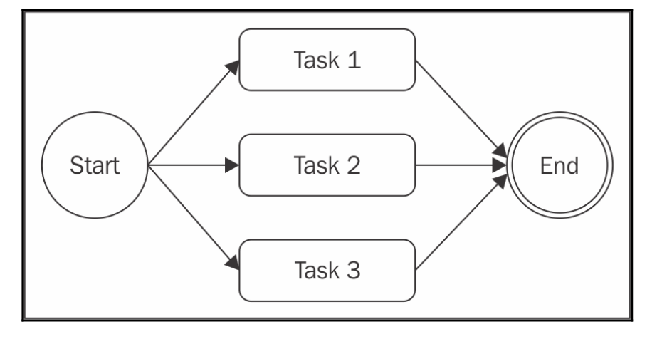
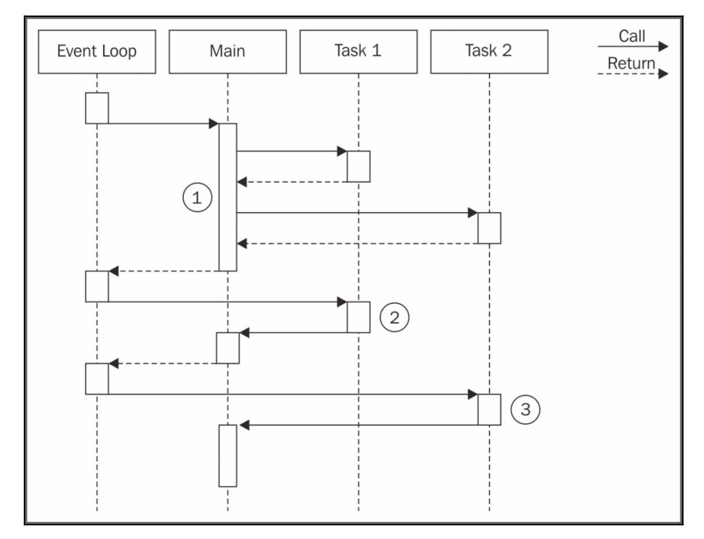
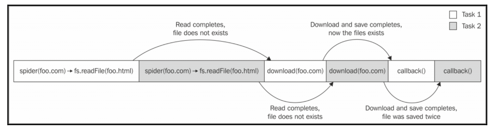

# Parallel execution

在某些情況下，一組異步任務的執行順序不重要，我們想要的只是在所有正在運行的任務完成時通知。 使用並行執行流(parallel execution flow)可以更好地處理這種情況，如下圖所示：




  This may sound strange if we consider that Node.js is single threaded, but if we remember what we discussed in Chapter 1, Welcome to the Node.js Platform, we realize that even though we have just one thread, we can still achieve concurrency, thanks to the non- blocking nature of Node.js. 

這可能聽起來很奇怪，如果我們認為Node.js是單線程的，但如果我們記住我們在第1章討論，歡迎來到Node.js平台，我們意識到，即使我們只有一個線程，我們仍然可以實現並發(concurrency) ，感謝Node.js的非阻塞性質。

  In fact, the word parallel is used improperly in this case, as it does not mean that the tasks run simultaneously, but rather that their execution is carried out by an underlying non-blocking API and interleaved by the event loop.

**事實上，在這種情況下，並行(parallel)字不正確地使用，因為它並不意味著任務同時運行，而是它們的執行由底層非阻塞API執行並由事件循環交錯。**

  As we know, a task gives control back to the event loop when it requests a new asynchronous operation allowing the event loop to execute another task. The proper word to use for this kind of flow is concurrency, but we will still use parallel for simplicity. 

我們知道，當一個任務請求一個新的異步操作，允許事件循環執行另一個任務時，控制權返回到事件循環。 用於這種流的適當詞是**並發(concurrency)**，但為了簡單起見，我們仍然使用**並行(parallel)**。

[concurrency 和 parallel 很好的圖示說明](https://bytearcher.com/articles/parallel-vs-concurrent/)

The following diagram shows how two asynchronous tasks can run in parallel in a Node.js program: 重要啊



  In Node.js, synchronous (blocking) operations cannot run concurrently unless their execution is interleaved with an asynchronous operation, or deferred with setTimeout() or setImmediate().

在Node.js中，同步（阻塞）操作不能並發運行，除非它們的執行與異步操作交錯，或者通過setTimeout（）或setImmediate（）延遲。 

我們將在第9章Advanced Asynchronous Recipes了解這一點。


## Web spider version 3

我們的網絡蜘蛛應用程序似乎是一個完美的候選人應用並行執行的概念。 我們可以通過並行下載所有鏈接的頁面來輕鬆提高此過程的性能。

為此，我們只需要修改spiderLinks（）函數，以確保立即生成所有的spider()任務，然後只有當所有的spider()任務完成執行時才調用最終的回調。 修改如下：

``` js
links.forEach(link => {
  spider(link, nesting - 1, done);
});
```

使我們的應用程序等待所有任務完成的訣竅是為spider（）函數提供一個特殊的回調函數，我們稱之為done（）。 當蜘蛛任務完成時，done（）函數記數+1。 當完成的下載數量達到links數的大小時，呼叫最終回調：

``` js
let completed = 0, hasErrors = false;

function done(err) {
    if(err) {
      hasErrors = true;
      return callback(err);
    }
    if(++completed === links.length && !hasErrors) {
      callback();
} }
```

改過的`spiderLinks()`:

```
$ git checkout spider-v3-1
$ yarn run test2
$ yarn run rm2
```

跑起來速度有差, 自己寫的範例, spider version 2 : 24.45sec,  spider version 3: 3.37sec 

## The pattern 

並行模式pattern如下: 

``` js
const tasks = [ /* ... */ ];
  
let completed = 0;

tasks.forEach(task => {
  task(() => {
    if(++completed === tasks.length) {
    finish(); }
  }); 
});

function finish() {
  //all the tasks completed
}
```

  With small modifications, we can adapt the pattern to accumulate the results of each task into a collection, to **filter** or **map** the elements of an array, or to invoke the finish() callback as soon as one or a given number of tasks complete (this last situation in particular is called **competitive race**). 

通過小的修改，我們可以調整模式以將每個任務的結果累積到集合中，過濾或映射數組的元素，或者在一個或給定數量的任務完成時調用finish（）回調。(這最後的情況特別被稱為競爭性競賽(competitive race)）。
 
以上這個pattern並無限制並行數量 (**unlimited parallel execution**)。

## Fixing race conditions with concurrent tasks

  Running a set of tasks in parallel can cause issues when using blocking I/O in combination with multiple threads. However, we have just seen that in Node.js this is a totally different story; running multiple asynchronous tasks in parallel is in fact straightforward and cheap in terms of resources. This is one of the most important strengths for Node.js, because it makes parallelization a common practice rather than a complex technique to only use when strictly necessary. 

並行運行一組任務可能會在與多個線程結合使用阻塞I / O時導致問題。 但是，我們剛剛看到，在Node.js中，這是一個完全不同的故事; 事實上並行運行多個異步任務在資源方面實際上是簡單和便宜的。 這是Node.js最重要的優勢之一，因為它使並行化成為一種常見的做法，而不是一種複雜的技術，只有在嚴格必要時才使用。


  Another important characteristic of the concurrency model of Node.js is the way we deal with task synchronization and race conditions. In multithreaded programming, this is usually done using constructs such as **locks**, **mutexes**, **semaphores**, and **monitors**, and it can be one of the most complex aspects of parallelization, which has considerable impact on performances as well. 

Node.js的並發模型的另一個重要特性是我們處理任務同步和競態條件的方式。 在多線程編程中，這通常使用諸如鎖，互斥體，信號量和監視器之類的構造，並且它可以是並行化的最複雜的方面之一，這也對性能有很大的影響。

在Node.js中，通常不需要一個複雜的同步機制，因為一切都在單個線程上運行

(me)Nodejs簡單化了平行處理的問題, 避免multi thread帶來的複雜度

  However, this doesn't mean that we can't have race conditions; on the contrary, they can be quite common. The root of the problem is the delay between the invocation of an asynchronous operation and the notification of its result.

但是**nodejs一樣會有競賽條件(race conditions)**; 相反，他們可能是很常見的。 **問題的根源是異步操作的調用和其結果的通知之間的延遲**。

spider程式存在一個race condition, 我們在開始下載相應的URL之前檢查文件是否已經存在：

``` js
function spider(url, nesting, callback) {
  const filename = utilities.urlToFilename(url);
  fs.readFile(filename, 'utf8', function (err, body) {
    if (err) {
      if (err.code !== 'ENOENT') {
        return callback(err);
      }
      return download(url, filename, (err, body) => {
```

在同一個URL上操作的兩個蜘蛛任務可能在兩個任務之一完成下載之前在同一個文件上調用fs.readFile（），並創建一個文件，導致兩個任務開始下載。 這種情況如下圖所示: 



(me) 我的例子執行就會出現重複下載的情況: 

```
$ node index https://webpack.js.org
Downloading https://webpack.js.org
Downloading https://webpack.js.org/guides/get-started
Downloading https://webpack.js.org/guides/get-started
Downloading https://webpack.js.org/organization
Downloading https://webpack.js.org/contribute
Downloading https://webpack.js.org/guides/why-webpack#comparison
Downloading https://webpack.js.org/branding
Downloading https://webpack.js.org/license
```

get-started被下載兩次

### 解決方法

我們需要的是一個變量，以便相互排除在同一個URL上運行的多個spider（）任務:

``` js
const spidering = new Map();
function spider(url, nesting, callback) {
  if(spidering.has(url)) {
    return process.nextTick(callback);
  }
  spidering.set(url, true);
  //...
```

查看一下: 

```
$ git checkout spider-v3-2
```


修正過後重複下載的情形就消失了: 

```
$ yarn run test2
yarn run v0.21.3
$ node index https://webpack.js.org
Downloading https://webpack.js.org
Downloading https://webpack.js.org/guides/get-started
Downloading https://webpack.js.org/organization
Downloading https://webpack.js.org/support
Downloading https://webpack.js.org/guides/why-webpack#comparison
Downloading https://webpack.js.org/branding
Downloading https://webpack.js.org/license
"undefined" was already downloaded
✨  Done in 2.26s.
```

(me) 修正一個錯誤: 

```
$ git checkout spider-v3-fix
```


  Race conditions can cause many problems, even if we are in a single-threaded environment. In some circumstances, they can lead to data corruption and are usually very hard to debug because of their ephemeral nature. So, it's always good practice to double check for this type of situation when running tasks in parallel. 
  
競態條件可能導致許多問題，即使我們在單線程環境中。 在某些情況下，它們可能導致數據損壞，並且由於它們的短暫性質通常很難調試。 因此，在並行運行任務時，仔細檢查這種類型的情況總是好的做法。

(me) 很難察覺..