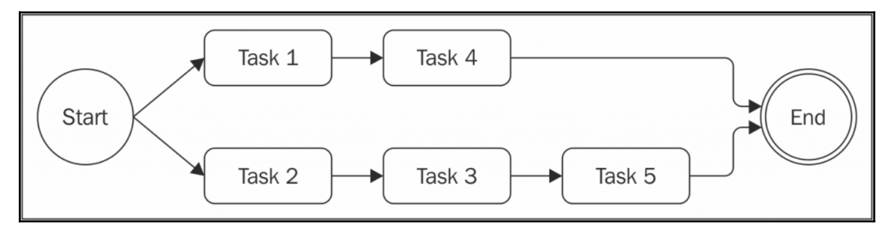

# Limited parallel execution


  Often, spawning parallel tasks without control can lead to an excessive load. Imagine having thousands of files to read, URLs to access, or database queries to run in parallel. A common problem in such situations is running out of resources, for example, by utilizing all the file descriptors available for an application when trying to open too many files at once. In a web application, it may also create a vulnerability that is exploitable with Denial of Service (DoS) attacks.

通常，在沒有控制的情況下產生並行任務可能導致過度負載。 假設有成千上萬個要讀取的文件，要訪問的URL或者並行運行的數據庫查詢。 在這種情況下的常見問題是耗盡資源，例如，當試圖一次打開太多文件時，利用應用程序可用的所有文件描述符。 在Web應用程序中，它還可能創建可利用拒絕服務（DoS）攻擊的漏洞。 

(me) [Denial of Service (DoS) 阻斷服務攻擊](https://zh.wikipedia.org/wiki/%E9%98%BB%E6%96%B7%E6%9C%8D%E5%8B%99%E6%94%BB%E6%93%8A) :分散式阻斷服務攻擊（distributed denial-of-service attack，縮寫：DDoS attack、DDoS）

在所有這些情況下，最好限制可以同時運行的任務數。 這樣，我們可以為我們的服務器的負載添加一些可預測性，並確保我們的應用程序不會耗盡資源。

下圖描述了一種情況，其中有五個任務並行運行，並發限制為2：
The following diagram describes a situation where we have five tasks that run in **parallel** with a **concurrency** limit of 2:



從上圖中，應該清楚我們的算法將如何工作：

1. Initially, we spawn as many tasks as we can without exceeding the concurrency limit. 最初，我們在不超過並發限制的情況下產生盡可能多的任務。

2. Then, every time a task is completed, we spawn one or more tasks until we don't reach the limit again. 然後，每當一個任務完成，我們產生一個或多個任務，直到我們沒有達到限制。

## Limiting the concurrency

We now present a pattern to execute a set of given tasks in parallel with limited concurrency:我們現在提出一種模式來並行執行一組給定的任務並行限制並發：

``` js
const tasks = ...
let concurrency = 2, running = 0, completed = 0, index = 0;
function next() {
  while(running < concurrency && index < tasks.length) {
    task = tasks[index++];
    task(() => {
      if(completed === tasks.length) {
        return finish();
      }
      completed++, running--;
      next();
    });
    running++; 
  }
} 
next();

function finish() {
  //all tasks finished
}
```

該算法可以被認為是順序執行(sequential execution)和並行執行(parallel execution)之間的混合。 

事實上，我們可能注意到與本章前面提到的模式的相似之處：

1. We have an iterator function, which we called next(), and then an inner loop that spawns in parallel as many tasks as possible while staying within the concurrency limit. 我們有一個迭代器函數，我們稱之為next（），然後是一個內部循環，盡可能多地並行執行任務，同時保持並發限制。

2. The next important part is the callback we pass to each task, which checks if we completed all the tasks in the list. If there are still tasks to run, it invokes next() to spawn another bunch of tasks. 下一個重要的部分是我們傳遞給每個任務的回調，它檢查我們是否完成了列表中的所有任務。 如果還有任務要運行，它會調用next（）來產生另一堆任務。

## Globally limiting the concurrency - Queues to the rescue

What we really want then, is to limit the global number of download operations we can have running in parallel. 我們真正想要的是限制我們可以並行運行的全局下載操作數。

我們可以使用 **queues** 來限制多個任務的並發性, 建立一個`taskQueue.js`(應用上述pattern): 

(me) task丟到queue裡面, 再由queue安排要去哪個pipe跑

``` js
class TaskQueue {
  constructor(concurrency) {
    this.concurrency = concurrency;
    this.running = 0;
    this.queue = [];
  }
     
  pushTask(task) {
    this.queue.push(task);
    this.next();
  }

  next() {
    while(this.running < this.concurrency && this.queue.length) {
      const task = this.queue.shift();
      task(() => {
        this.running--;
        this.next();
      });
      this.running++;
    }
  } 
}
```

該class的constructor僅接受concurrency limit為輸入, 初始化running和queue的數量

pushTask（）方法只是將一個新任務添加到隊列中，然後通過調用this.next（）來引導worker的執行。

next（）方法從隊列中生成一組任務，確保它不超過並發限制。


我們可能注意到這個方法與限制我們前面提到的並發性的模式有一些相似之處。它基本上從隊列中啟動盡可能多的任務，而不會超過並發限制。當每個任務完成時，它會更新正在運行的任務的計數，然後通過再次調用next（）來啟動另一輪任務。 

TaskQueue類的有趣的屬性是它允許我們動態地添加新的項目到隊列。另一個優點是，現在我們有一個中央實體(central entity)負責限制我們的任務的並發性，這可以在函數執行的所有實例之間共享。在我們的例子中，它是spider（）函數，我們稍後會看到。

## Web spider version 4

設定 concurrency limit 為 2

查看一下: 

```
$ git checkout spider-v4
```


- We run the spider() function by providing a custom callback.我們通過提供自定義回調來運行spider（）函數。

- In the callback, we check if all the tasks relative to this execution of the spiderLinks() function are completed. When this condition is true, we invoke the final callback of the spiderLinks() function. 在回調中，我們檢查與spiderLinks（）函數的這個執行相關的所有任務是否完成。 當這個條件為真時，我們調用spiderLinks（）函數的最終回調。

- At the end of our task, we invoke the done() callback so that the queue can continue its execution. 在我們的任務結束時，我們調用done（）回調，以便隊列可以繼續執行。

執行時候檢查看看是否一次最多兩個tasks在執行

